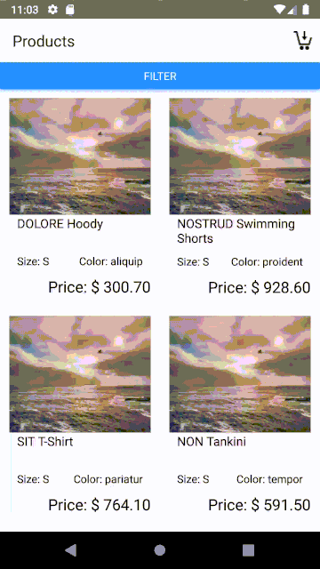
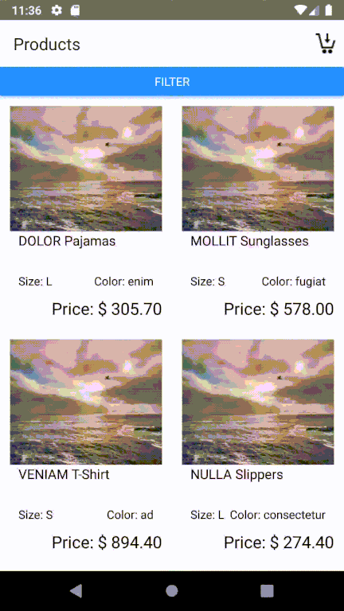
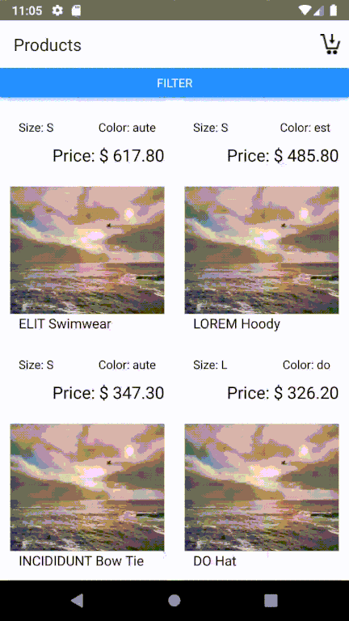
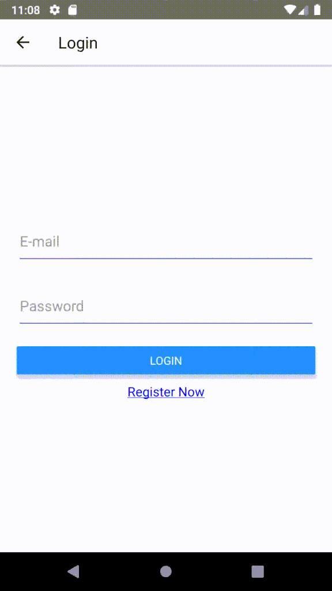
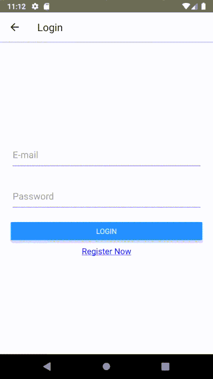
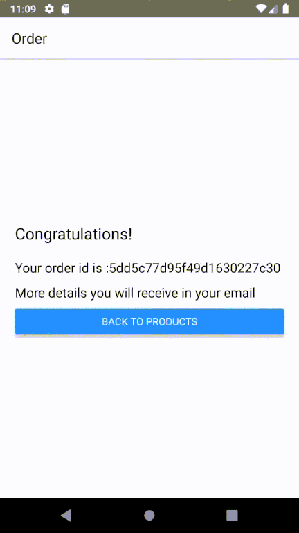

# RN Shop app
 This app was developed to demonstrate my capabilities using React Native, Graphql(Apollo) and mongoDB database.
 
## Demonstration
### Products
 This screen shows all products for the published merchants using infinite-scroll to pagination.  
 
### Filter
 In this feature is possible filter products by name, brand, size, color, merchant and price range.
   
 
### Details
This screen shows the product details. You can select the quantity and add to cart.  
 
### Cart
This screen show all added products. Is possible change the quantity and/or delete products 
  
 
### Login
If is the first user buy, the Login screen will show. After Login, the app will send your order for the database.
  
 
### Register
If the user wants to register, just click on Register now and create your user.
  
 
### Order
This screen shows the Order id.
  
 

## 📋 Next Release
  
  1. Implement Social Login
  2. Validate user E-mail
  3. Generate Token after Login
  4. Unit test
  5. Use Redux
  6. Test in Iphone Emulator.
  
  
## 🎉 Install

1. Ensure `yarn` is installed
2. Run mongodb on `localhost:27017`

## 🚀  Run

1. Navigate to `/server`, run `yarn start`
2. Navigate to `/client`, run `yarn ios` or `yarn android`

** This app was only tested in Android OS
